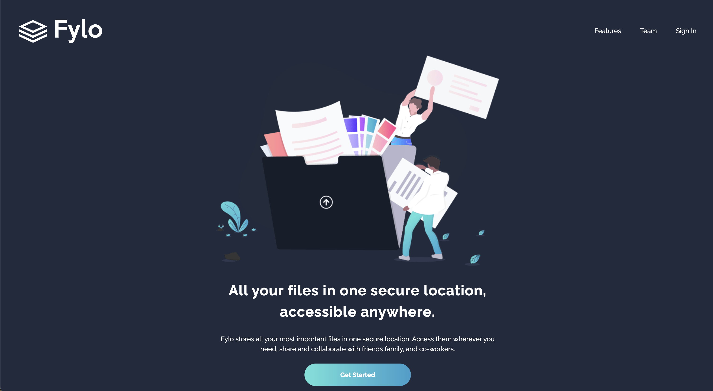

# Frontend Mentor - Fylo dark theme landing page solution

This is a solution to the [Fylo dark theme landing page challenge on Frontend Mentor](https://www.frontendmentor.io/challenges/fylo-dark-theme-landing-page-5ca5f2d21e82137ec91a50fd). Frontend Mentor challenges help you improve your coding skills by building realistic projects. 

## Table of contents

- [Overview](#overview)
  - [The challenge](#the-challenge)
  - [Screenshot](#screenshot)
  - [Links](#links)
- [My process](#my-process)
  - [Built with](#built-with)
  - [What I learned](#what-i-learned)
  - [Continued development](#continued-development)
- [Author](#author)

## Overview

### The challenge

Users should be able to:

- View the optimal layout for the site depending on their device's screen size
- See hover states for all interactive elements on the page

### Screenshot



### Links

- Solution URL: [GitHub](https://github.com/Ewelina-EN/fylo-dark-theme-landing-page)
- Live Site URL: [Demo](https://ewelina-en.github.io/fylo-dark-theme-landing-page/)

## My process

### Built with

- Semantic HTML5 markup
- CSS custom properties
- Flexbox
- CSS Grid

### What I learned

I finded solution how to make underline in link and image on the same time. ust wrap the text inside the <a></a> tags with a span and apply the border to the <span>instead of the <a> 

```html
<a href="" class="productive_link">
  <span>See how Fylo works </span>
</a>
```
```css
span {
    display: flex;
    flex-direction: row;
    align-items: center;
    border-bottom: 1px solid hsl(176, 68%, 64%);
}
```


### Continued development
This project can probably be done with less code. So I will focus on optimizing this and future projects.

## Author

- Website - [Ewelina Niewęgłowska](https://github.com/Ewelina-EN)
